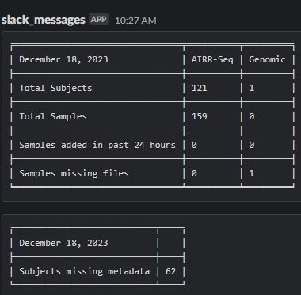

### Pipeline Data Management Scripts With Dropbox API - Setup Guide

## Introduction
This guide provides a comprehensive setup process for the "Pipeline Data Management Scripts with Dropbox API," a system designed to manage file contributions efficiently for macaque research data projects. This system integrates with Dropbox to monitor and manage new file submissions and communicates updates via Slack.

## GitHub
  [GitHub](https://github.com/yaarilab/Macaque-R24-FolderMonitoring) repository

## User Perspective
- **File Verification**: Ensures completeness and correctness of required files for each sample.
- **Metadata Updates**: Compares new samples against metadata from Emory, highlighting missing data in a spreadsheet.
- **Notifications**: Delivers daily reports on sample status and issues to the `#r24_macaque_samples` Slack channel.

## Operational Details
- **Run Time**: The script executes daily at 00.00 US EST.
- **Target Directory**: Monitors `/macaque r24/sequencing` on Dropbox. This path is configurable in `app.py`.
- **Metadata File**: Uses `config.json` for metadata checks, located in the target directory.

## Slack Channel Notifications
Notifications and summary tables are sent to the `#r24_macaque_samples` Slack channel.

## Tables Generated
1. **Slack Table 1**: Summary of AIRR-Seq and Genomic samples.
2. **Slack Table 2**: Details on subjects missing metadata.
3. **Excel Table**: Tracks file paths and pipeline status.

---

## Installation Guide

### Server Setup
- **Location**: The script is hosted on Jenkins at `/misc/work/jenkins/dropbox_scripts/`, use `git clone https://github.com/yaarilab/Macaque-R24-FolderMonitoring` and place those files in the right folder.

### Configuration
- **File**: `secrets.json` contains crucial settings like Slack Webhook URL and Dropbox credentials.
- **User**: Runs under the `igguest` account.

### Initial Setup Steps
1. **Dropbox App Creation**: Go to the [Dropbox Developers Console](https://www.dropbox.com/developers/apps) to create an app for APP_KEY and APP_SECRET.
2. **Authorization Code**: Obtain this from the provided URL.
3. **Set Constants**: Define `SOURCE_PATH` and other necessary constants.
4. **Script Placement**: Locate the script in `/misc/work/jenkins/dropbox_scripts/` for execution on Jenkins.

### Creating the Secrets File
- **Structure**: Populate `secrets.json` with APP_KEY, APP_SECRET, REFRESH_TOKEN, and Slack Webhook URL.
- **secrect.json structure:**
```json
{
  "WEBHOOK_URL": "",
  "REFRESH_TOKEN": "",
  "APP_KEY": "",
  "APP_SECRET": ""
}
```
- **Token Generation**: Use `generate_refresh_token()` function to obtain `REFRESH_TOKEN`.
- **Slack Webhook**: Create this via Workspace settings in Slack.

## Component Overview

### App.py
- **Functionality**: Uses a cursor for tracking and resuming operations.
- **Key Method**: `start_new_check()` for processing Dropbox files and updating summaries.

### FolderMonitor.py
- **Capabilities**: Handles metadata processing, file system checks, Slack messaging, and Excel file updates.
- **Primary Function**: `check_new_subject()` for initiating folder checks.

### ServerDropbox
- **Features**: Manages Dropbox interactions like token refreshing, file listing, and downloading.

## Operational Flow

### Code Repository
- **Location**: [Macaque-R24-FolderMonitoring](https://github.com/yaarilab/Macaque-R24-FolderMonitoring) on GitHub.

### Script Execution
- **Libraries Used**: `requests`, `pandas`, `tabulate`, `gzip`, `shutil`.
- **Process**:
  1. Reads `secrets.json` for initial setup.
  2. Monitors Dropbox for new files.
  3. Validates files against `metadata.json`.
  4. Manages file processing and metadata updates.
  5. Sends summaries to Slack.

### Dropbox Python SDK
- **Usage**: Accesses Dropbox directories using the SDK.
- **Documentation**: Available [here](https://www.dropbox.com/developers/documentation/python).

---

### Example Usage of the Macaque R24 to BIU System

#### Scenario: Monitoring and Downloading New Files

1. **Automated Monitoring**:
   - The system is scheduled to run automatically at 00.00 US EST every day.
   - It checks the `/macaque r24/sequencing` folder in Dropbox for new file submissions.

2. **File Download Process**:
   - Upon detecting new files, the system automatically downloads them to the BIU file system, specifically to the path set in `OUTDIR`.

#### Example Terminal Output for Automated Monitoring and Download
```
[00:00 US EST] Starting daily check for new files in /macaque r24/sequencing...
New files detected: 3
Initiating download to /misc/work/sequence_data_store/...
Download complete. Files stored in /misc/work/sequence_data_store/.
```

#### Scenario: Updating Metadata and Reporting to Slack

1. **Metadata Update**:
   - After downloading, the system consults the metadata from Emory stored in `Macaque R24/subject_metadata/metadata.xlsx`.
   - It creates a spreadsheet listing missing metadata for new samples and subjects, stored in `Macaque R24/results/missing.xlsx`.

2. **Slack Notification**:
   - The system sends a daily summary report to the `#r24_macaque_samples` Slack channel.
   - The report includes the number of samples downloaded, samples missing files, and subjects missing metadata.

#### Example Slack Notification


#### Notes for Users
- The system is designed to run automatically, but users should verify the setup, including the Dropbox folder path and Slack channel configuration.
- Regularly check the `missing.xlsx` file for updates on missing metadata and take necessary actions.
- Stay informed about the daily reports on the Slack channel for any immediate attention required.

This example provides a clear illustration of how the "Macaque R24 to BIU" system operates, demonstrating typical use cases like automated file monitoring, downloading, metadata updating, and Slack reporting.