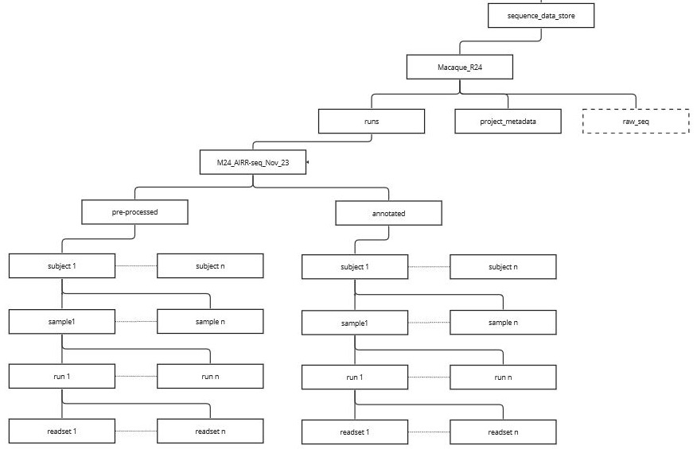

# Comprehensive Setup Guide for Download Repertoires and Metadata Script

## Introduction
This guide is for set up the "Download Repertoires and Metadata" Python script suite. These scripts automate downloading genomic data and metadata from various online repositories, organizing the data, and converting it into a structured and usable format.

## Overview

The script provides an interactive command-line interface for selecting repositories, specifying download directories, and entering study IDs. It uses Python libraries for asynchronous processing and data management. After downloading, it structures the data and converts JSON formatted data into TSV files.


## Script Components Overview
1. **download_repertoires_and_metadata.py**: Manages downloading of repertoires and metadata.
2. **create_projects_structure.py**: Organizes downloaded data into a structured directory format.
- **Image Reference**: 
 ****

3. **json_to_tsv.py**: Converts JSON formatted data into TSV files.

## Step-by-Step Setup

### 1. Setting Up download_repertoires_and_metadata.py
- **Location**: Find the script at `/misc/work/genotype_tool-command_line/` on the BIU server or clone it from the GitHub repository.
- **Customization**:
  - **Repository URLs**: Modify `default_repository_df` to change or add repository URLs.
  - **Output Directory**: Change `OUTDIR` to your preferred download location.

### 2. Setting Up create_projects_structure.py
- **Project Path**: Adjust `PROJECTS_PATH` to the directory where you want the structured data stored.
- **Slugify Function**: Customize this function for specific file naming conventions if necessary.

### 3. Setting Up json_to_tsv.py
- **Source Path**: Update `SOURCE` to the root directory where your project's data is stored.
- **Metadata and Output Paths**: Modify `METADATA_PATH`, `BIOSAMPLE_OUTPUT`, and `SRA_OUTPUT` to reflect your project's structure.
- **JSON Format Paths**: Ensure `BIOSAMPLE_JSON_FORMAT_PATH` and `SRA_JSON_FORMAT_PATH` are correctly set.

## Running the Scripts

### download_repertoires_and_metadata.py
- Navigate to the script's directory.
- Execute `python download_repertoires_and_metadata.py`.
- Follow the prompts to select repositories and start the download.

### create_projects_structure.py
- This script is automatically invoked post-download. Verify `PROJECTS_PATH` is correctly set.

### json_to_tsv.py
- This script is automatically invoked after data structuring.


### Revised Example Run of the Script Suite

#### Step 1: Running download_repertoires_and_metadata.py
1. **Open Terminal or Command Prompt**:
   - Navigate to the directory where `download_repertoires_and_metadata.py` is located.

2. **Execute the Script**:
   - Run the command: `python download_repertoires_and_metadata.py`.

3. **Script Interaction**:
   - The script prompts for the study ID. 
     - User inputs: `12345`.
   - The script displays a list of available repositories and asks which to download from.
     - User inputs: `1 3 5` (selecting repositories 1, 3, and 5).
   - The script starts the download process and provides status updates.
   - Repeat for additional study IDs or exit with "exit."

#### Step 2: Automatic Execution of create_projects_structure.py
- After the download is complete, `create_projects_structure.py` automatically runs.
- It organizes the downloaded data into the specified directory structure.
- The user sees messages indicating the progress of data organization.

#### Step 3: Automatic Execution of json_to_tsv.py
- Following the organization of data, `json_to_tsv.py` automatically executes.
- This script converts the organized JSON data into TSV format.
- The user observes messages indicating the conversion process and completion.

#### Example Terminal Output
```
$ python download_repertoires_and_metadata.py
Enter study ID, or exit to finish: 12345
Available repositories:
0. Select all repositories
1. https://covid19-1.ireceptor.org
2. https://covid19-2.ireceptor.org
...
Enter the indices of the repositories you want to download from (e.g., 1 2 3, or 0 for all): 1 3 5
Sending search request...
Found 10 repertoires.
Sending download request...
Download initiated. Downloader ID: 1

[After Download]
Organizing downloaded data...
Data organization completed.

[Automatically Running json_to_tsv.py]
Converting JSON data to TSV format...
Conversion completed successfully.
```

