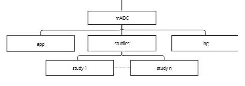

# Minimal ADC Server (mADC) - Specification Document

## Summary

The Minimal ADC Server (mADC) is designed to implement a core subset of the AIRR Data Commons API. This implementation focuses on essential functionalities that enable users to interrogate available repertoires and download specific repertoires as needed.

## AIRR Data Commons API Support

mADC will support the following API endpoints:

| Endpoint                         | Type               | HTTP Method | Description                                                                                      |
|----------------------------------|--------------------|-------------|--------------------------------------------------------------------------------------------------|
| `/v1`                            | Service status     | GET         | Returns success if the API service is operational.                                               |
| `/v1/info`                       | Service information| GET         | Provides service information such as name, version, etc., upon successful request.               |
| `/v1/repertoire/{repertoire_id}` | Retrieve repertoire| GET         | Returns Repertoire information in JSON format based on the Repertoire schema for a given ID.     |
| `/v1/repertoire`                 | Query repertoires  | POST        | Returns a list of Repertoires in JSON format based on the Repertoire schema.                     |
| `/v1/rearrangement`              | Query rearrangements| POST       | Returns a list of Rearrangements in JSON or AIRR TSV format based on the Rearrangement schema.   |

## Implementation

### REST API Implementation

The mADC is developed using Python 3.10 and Flask 2.3.3, along with Flask-RESTX. Despite the release of Flask 3 in September 2023, it was decided not to adopt it immediately due to the lack of compelling new features for this application.

Key features of the Flask application include:

- Logging of API requests using `app.logger`.
- Organizing requests in separate files using blueprints (service-related endpoints in `service.py`, repertoire-related in `repertoire.py`).
- Auto-generation of Swagger UI documentation via Flask-RESTX.
- Configuration management (host, file paths, service info for `/v1/info` endpoint, etc.) through `app.config.from_file`.

Further details on these features are available in the referenced articles.

### Hosting

Initially, mADC is intended for local development environments. Post-development, it will be containerized using Docker and integrated with the existing front-end infrastructure shared by OGRDB and VDJbase.

### File Structure

The file structure includes designated directories for logs and studies, with paths specified in `madc.conf`.


## API Restriction

### Repertoire Endpoint

The Repertoire endpoint allows minimal filtering based on study ID:

```json
{
  "filters": {
    "op": "=",
    "content": {
      "field": "study.study_id",
      "value": "<study_id>"
    }
  }
}
```

Requests with non-compliant filters will be rejected. Absence of a filter returns metadata for all repertoires.

### Rearrangement Endpoint

Rearrangement requests must include a filter specifying the repertoires:

```json
{
  "filters": {
    "op": "in",
    "content": {
      "field": "repertoire_id",
      "value": ["<list of repertoires>"]
    }
  },
  "facets": "repertoire_id"
}
```

### Downloading TSV Files

For downloading TSV files, the following filter structure is used:

```json
{
  "filters": {
    "op": "=",
    "content": {
      "field": "repertoire_id",
      "value": "<repertoire_id>"
    }
  },
  "format": "tsv"
}
```

This allows users to download specific repertoire data in TSV format.

Non-compliant or missing filters in requests will be rejected.


## Business Logic

Upon startup, the application scans the studies directory, creating an in-memory data structure to map repertoires to their file paths. This structure facilitates request handling in conjunction with the actual files. It's assumed that the studies file tree remains static during execution; any changes necessitate a restart of the application.

## Additional Utilities

- **Metadata.json Creation**: A utility to generate metadata compliant with the MiAIRR schema from simpler formats (e.g., CSV).
- **Metadata Validation**: A utility to validate metadata files against the MiAIRR schema.

The AIRR Python Reference Library will be instrumental for these utilities, ensuring schema compliance and validation.

